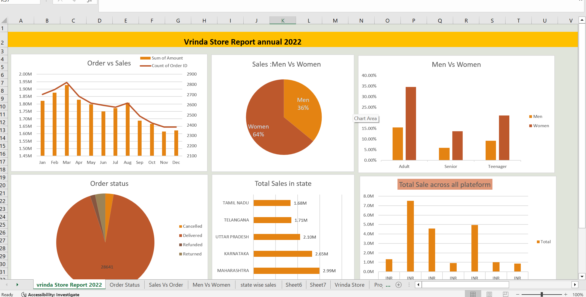

# Vrinda Store Sales Report - Annual 2022

This report presents a detailed analysis of Vrinda Store's sales performance for the year 2022. The data has been visualized using multiple charts and graphs to gain clear insights into sales trends, customer demographics, order statuses, and state-wise performance.

---

## Key Visual Insights

### 1. **Order vs Sales (Monthly Trends)**
- **Insight**: The graph shows the monthly trend of the total order amount and the count of orders.
- **Observation**: Highest orders and sales were seen in **March**. There is a slight dip in sales after April with the lowest sales in **November**.

### 2. **Sales: Men vs Women**
- **Insight**: Pie chart shows percentage contribution to sales by gender.
- **Observation**: **Women** customers contributed **64\%** to total sales while **Men** contributed **36\%**.

### 3. **Demographics: Men vs Women across Age Groups**
- **Insight**: Clustered bar chart comparing male vs female buyers by age group.
- **Observation**:
  - Most **Adult** buyers are women.
  - **Teenagers** and **Seniors** also have a higher proportion of women buyers compared to men.

### 4. **Order Status**
- **Insight**: Pie chart showing delivery performance and return/refund trends.
- **Observation**: A huge majority of orders were **Delivered** with only a small percentage being **Cancelled**, **Refunded**, or **Returned**.

### 5. **Total Sales by State**
- **Insight**: Horizontal bar chart showing sales volume per state.
- **Observation**:
  - **Maharashtra** leads with **2.99M** sales.
  - Followed by **Karnataka** (2.65M) and **Uttar Pradesh** (2.10M).

### 6. **Platform-wise Sales**
- **Insight**: Bar chart comparing total sales across different platforms.
- **Observation**: One platform significantly outperformed others, crossing **8M INR** in sales.

---

## Screenshot of Dashboard

---

## Conclusion
This dashboard provides a quick overview of how Vrinda Store performed in 2022 in terms of revenue, customer demographics, and regional presence. It helps decision-makers focus on target customer groups and optimize regional strategies for the upcoming year.

---

**Created using Microsoft Excel | Powered by Data Analysis & Visualization**

